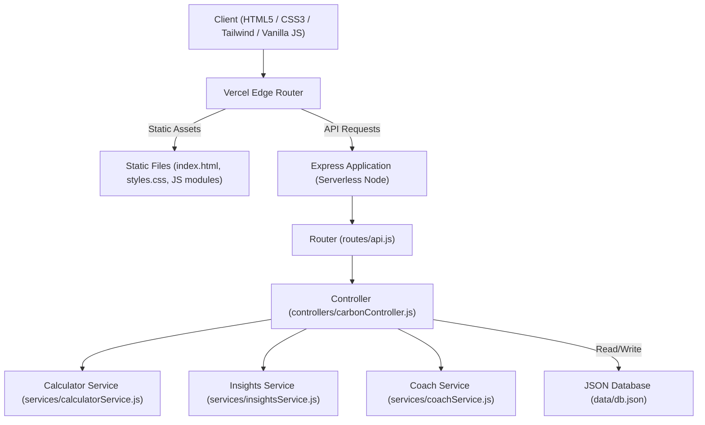
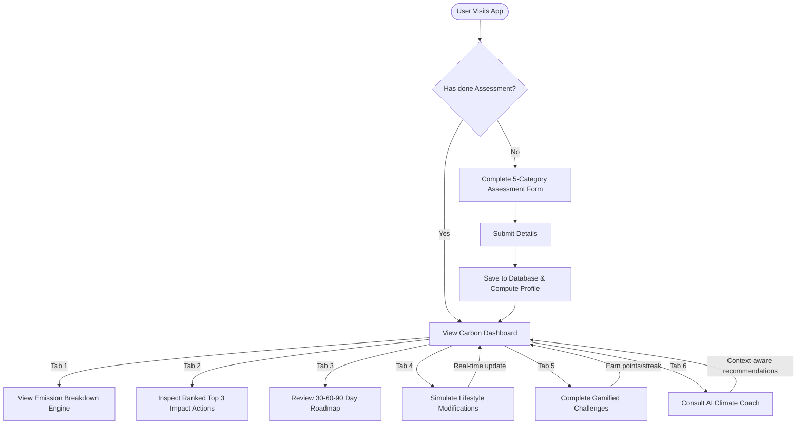
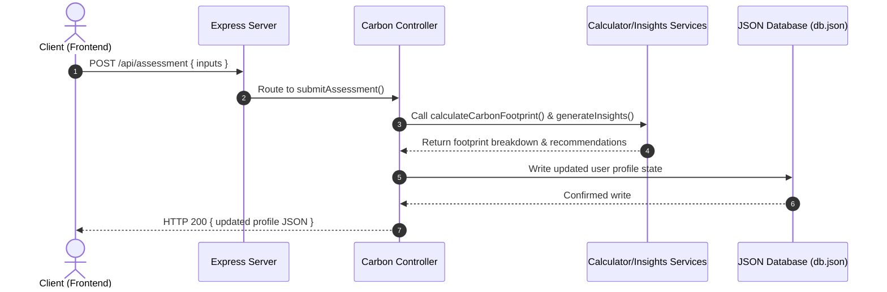
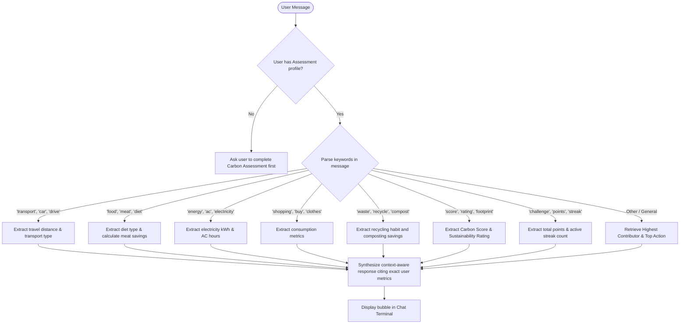

# CarbonLens

See Your Impact. Shape a Greener Future.

---

[](https://github.com/PAWANBHOWATE04/carbonlens)
[](https://vercel.com)
[](https://jestjs.io)
[](https://nodejs.org)
[](https://w3c.github.io/aria/)

---

## 1. Project Overview

**CarbonLens** is an AI-powered sustainability decision coach that helps users understand, track, simulate, and reduce their carbon footprint through personalized insights, recommendation roadmaps, lifestyle simulations, and weekly challenges.

Unlike typical calculator utilities that merely sum up inputs, CarbonLens acts as a personal sustainability coach. It performs data-driven analysis of user behaviors to outline high-impact reductions, construct progressive 30-60-90 day timeline roadmaps, and support custom, context-aware consultations.

---

## 2. Challenge Context

CarbonLens was developed for **Prompt Wars Challenge 3: Carbon Footprint Awareness Platform**. The prompt mandates a solution that demonstrates intelligent smart assistant behavior, clean serverless-ready architecture, rigorous data validation, keyboard accessibility support, and unit tests for calculators and insights.

---

## 3. Problem Statement

Individual carbon tracking tools are often underutilized due to:
*   **Action Paralysis**: Simple numerical calculators leave users with raw figures (e.g., "1.2 Tons CO₂/month") but no clear next steps.
*   **Generic Recommendations**: Recommending that a user cycle to work when they don't own a car or have a 60 km commute is irrelevant and frustrates users.
*   **Lack of Gamification**: Without progress trackers, streaks, or points, users lose motivation to maintain eco-habits.
*   **Static Modelling**: Users cannot preview the impact of potential lifestyle modifications before making real-world commitments.

---

## 4. Solution Overview

CarbonLens bridges this gap through a feedback loop of assessment, analysis, simulation, and gamification:

| Feature | Standard Calculators | CarbonLens Coach |
| :--- | :--- | :--- |
| **Output Type** | Raw carbon weight figures | Carbon Score (0-100) & Rating Badges |
| **Action Plan** | Bullet list of generic tips | Tailored Top 3 Actions ranked by Impact Score |
| **Progression** | Static single calculation | Dynamic 90-day progressive Roadmap |
| **Forecasting** | None | Interactive slider-based habit Simulator |
| **Engagement** | Static text display | Gamified Challenges, Points, and Streaks |
| **Assistance** | Static FAQ sections | Context-aware AI Climate Consultant Coach |

---

## 5. Key Features

1.  **Carbon Assessment**: Collects travel, diet, home utilities (electricity and AC), shopping, and waste habits. Evaluates results to return a Carbon Score and Rating (`Green`, `Improving`, `High Impact`).
2.  **Emission Breakdown Engine**: Evaluates category percentages and highlights the highest and lowest emission sources.
3.  **Top 3 Actions Engine**: Scores and ranks recommendations by **Impact Score** (annual carbon reduction relative to implementation difficulty).
4.  **Personal Carbon Roadmap**: Provides a 30-60-90 day progressive action plan tailored to the user's specific lifestyle profile.
5.  **Impact Simulator**: Allows users to drag sliders to adjust travel and energy habits, showing a side-by-side comparison of current vs. predicted footprint.
6.  **Gamified Challenges**: Tracks streaks, completion states, and points for eco-habits like No-Car Friday.
7.  **AI Decision Coach**: A context-aware advisor that parses chat messages and references the user's assessment data to give specific, personalized recommendations.

---

## 6. Smart Decision Coach Logic

The AI Decision Coach uses rule-based parsing of user prompts combined with the active user profile:
*   If the user asks about **transportation**, the coach references the user's daily travel distance and vehicle type, calculates potential transit savings, and recommends the No-Car Friday challenge.
*   If the user asks about **diet**, the coach references their food habits, estimates the annual savings of switching to a plant-based diet, and suggests the Plant-Based Monday challenge.
*   If the user asks about **energy**, the coach references their AC runtimes and electricity bills, recommending AC optimization.
*   It prioritizes actions based on the user's highest emissions category, ensuring that advice remains highly relevant and impactful.

---

## 7. Carbon Calculation Methodology

Emissions are calculated monthly based on standard carbon factors:

### Transportation
$$\text{Transport } \text{CO}_2 = \text{Daily Distance (km)} \times 30 \text{ days} \times \text{Factor}$$
*   **Factors (kg CO₂/km)**: Gasoline Car: `0.18`, Diesel Car: `0.17`, Electric Car: `0.05`, Public Transit: `0.04`, Biking/Walking: `0.0`.

### Food & Diet
*   **Factors (kg CO₂/month)**: Heavy Meat: `250`, Mixed Diet: `150`, Vegetarian: `80`.

### Home Energy
$$\text{Energy } \text{CO}_2 = (\text{Electricity (kWh)} \times 0.4) + (\text{AC Hours} \times 18)$$
*   **Electricity Factor**: `0.4` kg CO₂/kWh.
*   **AC Factor**: `18` kg CO₂ per daily run-hour/month (based on a 1.5 kW unit over 30 days multiplied by the grid factor).

### Shopping
*   **Factors (kg CO₂/month)**: Frequent: `250`, Moderate: `100`, Infrequent: `30`.

### Waste & Recycling
*   **Factors (kg CO₂/month)**: Never Recycle: `50`, Sometimes: `25`, Always Recycle: `10`.

### Scoring & Categorization
$$\text{Carbon Score} = \max\left(0, 100 - \text{round}\left(\frac{\text{Total Monthly } \text{CO}_2}{15}\right)\right)$$
*   **Score $\ge$ 75**: `Green` rating.
*   **Score 45 to 74**: `Improving` rating.
*   **Score < 45**: `High Impact` rating.

---

## 8. Project Architecture

The application is built as an Express backend serving a static HTML5/Tailwind/Vanilla JS single-page application.



---

## 9. User Flow Diagram



---

## 10. API Flow Diagram



---

## 11. Decision Coach Flowchart



---

## 12. Accessibility Features

Accessibility is treated as a first-class feature:
*   **Keyboard Navigation**: All tabs, inputs, cards, check toggles, and buttons are keyboard focusable and navigable with visible focus states.
*   **Screen Reader Support**: Implements ARIA tags (`role="main"`, `role="banner"`, `role="navigation"`, `role="log"`, `aria-live="polite"`, `aria-selected`).
*   **Contrast & Semantics**: Employs semantic elements (`<header>`, `<nav>`, `<main>`, `<section>`) with high-contrast text ratios for comfortable reading.
*   **Skip Navigation Link**: Provides a keyboard-accessible skip link to immediately bypass header menus.

---

## 13. Security Features

*   **Input Validation**: Strict type, length, and range checks for numerical variables (e.g., daily distance, electricity, and AC hours).
*   **Sanitization Filters**: Encodes username keys and coach chat inputs on the server to prevent HTML and script injection.
*   **Error Handling**: Catches exceptions in controller requests and database read/write queries to prevent system crashes and keep database modifications safe.

---

## 14. Testing Strategy

Automated tests are implemented using Jest:
*   **Calculator tests (`tests/calculator.test.js`)**: Verifies calculations and ratings against high, medium, and low-emission profiles.
*   **Insights tests (`tests/insights.test.js`)**: Confirms contributor highlights, sorted Top 3 recommendations, and roadmap milestones.
*   **Simulator tests (`tests/simulator.test.js`)**: Validates predicted habit modifications.

Run the test suite locally with:
```bash
npm test
```

---

## 15. Folder Structure

```text
carbonlens/
│
├── public/
│   ├── index.html
│   ├── css/
│   │   └── styles.css
│   ├── js/
│   │   ├── app.js
│   │   ├── calculator.js
│   │   ├── insights.js
│   │   ├── simulator.js
│   │   └── coach.js
│   └── assets/
│
├── server/
│   ├── server.js
│   ├── routes/
│   │   └── api.js
│   ├── controllers/
│   │   └── carbonController.js
│   ├── services/
│   │   ├── calculatorService.js
│   │   ├── insightsService.js
│   │   └── coachService.js
│   └── data/
│       └── db.json
│
├── tests/
│   ├── calculator.test.js
│   ├── insights.test.js
│   └── simulator.test.js
│
├── package.json
├── vercel.json
├── README.md
└── .gitignore
```

---

## 16. Installation Guide

### Prerequisites
*   [Node.js](https://nodejs.org) (v16+)
*   npm

### Installation
1. Clone the repository:
   ```bash
   git clone https://github.com/PAWANBHOWATE04/carbonlens.git
   cd carbonlens
   ```
2. Install dependencies:
   ```bash
   npm install
   ```

---

## 17. Local Development

Start the Express development server:
```bash
npm start
```
The server will start on port 3000. Open [http://localhost:3000](http://localhost:3000) in your browser.

---

## 18. Deployment Guide

### Vercel Serverless Deployment
CarbonLens is fully configured for serverless deployment on Vercel:
1. Ensure the Vercel CLI is installed:
   ```bash
   npm install -g vercel
   ```
2. Run the deployment command in the project root:
   ```bash
   vercel
   ```
3. Complete the prompt setup details. Vercel will build the static public assets and host the serverless Express functions as configured in `vercel.json`.
4. Deploy to production:
   ```bash
   vercel --prod
   ```

---

## 19. Future Enhancements

*   **OAuth Authentication**: Integration of Google/GitHub social logins.
*   **Third-Party API Integrations**: Direct lookup of grid carbon intensity from Tomorrow.io or Electricity Maps APIs.
*   **Global Leaderboards**: Allow users to share scores and compete in teams or cities.
*   **Receipt Scanning OCR**: Extract food and shopping emissions from scanned receipts.

---

## 20. License

This project is licensed under the ISC License - see the `package.json` file for details.
